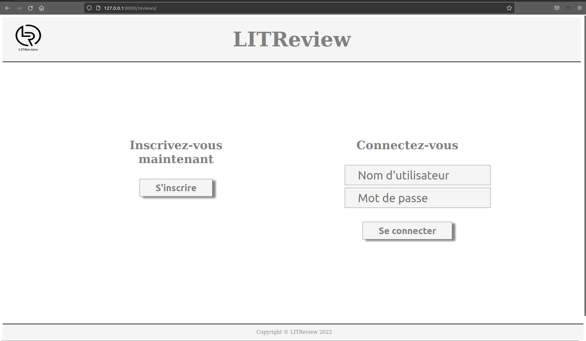

# DA_Python_P09 - Développez une application Web en utilisant Django

Développez une application Web en utilisant Django

# Table des matières<a name="Table_of_Contents"></a>
- [DA_Python_P09 - Développez une application Web en utilisant Django](#da_python_p09---développez-une-application-web-en-utilisant-django)
- [Table des matières<a name="Table_of_Contents"></a>](#table-des-matières)
  - [INTRODUCTION <a name="INTRODUCTION"></a>](#introduction-)
  - [Objectifs du projet <a name="objectifs"></a>](#objectifs-du-projet-)
  - [FEATURES <a name="FEATURES"></a>](#features-)
  - [REQUIREMENTS <a name="REQUIREMENTS"></a>](#requirements-)
    - [Récupération du projet <a name="Recup_projet"></a>](#récupération-du-projet-)
    - [Création d'un environnement virtuel Python <a name="Env_Virtuel_Python"></a>](#création-dun-environnement-virtuel-python-)
    - [Installation des packages Python nécessaire <a name="Installation_package"></a>](#installation-des-packages-python-nécessaire-)
  - [Lancement du serveur web  <a name="Validateur_HTML_no_charged"></a>](#lancement-du-serveur-web--)
  - [Accès à l'application web <a name="access_app"></a>](#accès-à-lapplication-web-)
  - [Home page <a name="home_page"></a>](#home-page-)
  - [Liste des utilisteurs existants <a name="utilisateurs_existants"></a>](#liste-des-utilisteurs-existants-)
  - [Utilisateur admin <a name="utilisateurs_existants"></a>](#utilisateur-admin-)
  - [Arborescence du projet <a name="Tree_project"></a>](#arborescence-du-projet-)
  - [Repartir sur base de données sans data <a name="reset_data"></a>](#repartir-sur-base-de-données-sans-data-)
  - [Contact <a name="Contact"></a>](#contact-)


## INTRODUCTION <a name="INTRODUCTION"></a>

LITReview est une jeune startup.
Son objectif est de commercialiser un produit permettant à une communauté d'utilisateurs de consulter ou de solliciter une critique de livres à la demande.
LITReview a réussi à lever un financement ! Elle a donc le feu vert pour développer une nouvelle application web. Cette application permet de demander ou publier des critiques de livres ou d’articles.


## Objectifs du projet <a name="objectifs"></a>

L'objectif est de développer une application Web avec le framework Django. Cette application serra un MVP  (minimum viable product, ou produit viable minimum).

L’application présente deux cas d’utilisation principaux : 

- Les personnes qui demandent des critiques sur un livre ou sur un article particulier ;
- Les personnes qui recherchent des articles et des livres intéressants à lire, en se basant sur les critiques des autres.


[<div align="center">[Table of Contents]</div>](#Table_of_Contents) 

## FEATURES <a name="FEATURES"></a>

- se connecter et s’inscrire – le site ne doit pas être accessible à un utilisateur non connecté 
- consulter un flux contenant les derniers tickets et les commentaires des utilisateurs qu'il suit, classés par ordre chronologique, les plus récents en premier ; 
- créer de nouveaux tickets pour demander une critique sur un livre/article ;
-	créer des critiques en réponse à des tickets ;
- créer des critiques qui ne sont pas en réponse à un ticket. Dans le cadre d'un processus en une étape, l'utilisateur créera un ticket puis un commentaire en réponse à son propre ticket ;
- voir, modifier et supprimer ses propres tickets et commentaires ; 
- suivre les autres utilisateurs en entrant leur nom d'utilisateur ;
- voir qui il suit et suivre qui il veut ; 
- cesser de suivre un utilisateur. 


[<div align="center">[Table of Contents]</div>](#Table_of_Contents)

## REQUIREMENTS <a name="REQUIREMENTS"></a>
  - Une version de Python doit être installée sur votre poste, au moins la version 3.8.8 est conseillée. 
  - Voici un wiki pour installer Python selon votre système d'exploitation : https://fr.wikihow.com/installer-Python

  - Il est recommander de récupérer le projet en utilisant "git clone" ou en téléchargeant directement le projet.
  - Une connexion internet fonctionnelle est nécessaire pour la partie installation.

** Dans cette documention, nous donnons les commandes pour un système d'exploitation Linux (fonctionne aussi pour Mac). Si vous êtes sous Windows, il faut adapter les commandes à votre OS.


### Récupération du projet <a name="Recup_projet"></a>

- Par téléchargement:
  
 lien de téléchargement : https://github.com/lahou-sys/DA_Python_P09/archive/refs/heads/master.zip

- Par "git clone":
  
```ssh
git clone https://github.com/lahou-sys/DA_Python_P09.git
```


[<div align="center">[Table of Contents]</div>](#Table_of_Contents) 


### Création d'un environnement virtuel Python <a name="Env_Virtuel_Python"></a>

Se positionner dans le dossier de votre choix et qui hébergera le projet Django.

Si le module python "venv" n'est pas installé sur votre système, il est nécessaire de l'installer comme ci-dessous :

  - Installation du module "venv"

```ssh

$ pip install venv

```

  - Création de l'environnement virtuel Python

```ssh

$ cd DA_Python_P09
$ python3 -m venv .venv

```

  - Activation de l'environnement virtuel Python

```ssh

$ source ./.venv/bin/activate

```

[<div align="center">[Table of Contents]</div>](#Table_of_Contents) 

### Installation des packages Python nécessaire <a name="Installation_package"></a>

l'installation de ces packages sont nécessaire pour la bonne éxécution du script.

- Django==4.0.3
- Pillow==9.0.1

    - Installation automatique des packages ( se positionner dans le dossier du projet "DA_Python_P09")

```ssh

$ pip install -r requirements.txt

```


[<div align="center">[Table of Contents]</div>](#Table_of_Contents) 

## Lancement du serveur web  <a name="Validateur_HTML_no_charged"></a>

Lançons le serveur de développement, démarrez-le comme ceci :

Se positionner dans le dossier de l'application récupérée sur Gihub ("DA_Python_P09").

```ssh

$ cd LITReview
$ python manage.py runserver

```

Exemple de sortie:

```ssh
Watching for file changes with StatReloader
Performing system checks...

System check identified no issues (0 silenced).
March 28, 2022 - 23:19:44
Django version 4.0.3, using settings 'LITReview.settings'
Starting development server at http://127.0.0.1:8000/
Quit the server with CONTROL-C.

```

[<div align="center">[Table of Contents]</div>](#Table_of_Contents)

## Accès à l'application web <a name="access_app"></a>

Pour utiliser l'application, ouvrer votre navigateur préféré et taper l'URL suivante:

- http://127.0.0.1:8000/reviews/


[<div align="center">[Table of Contents]</div>](#Table_of_Contents)

## Home page <a name="home_page"></a>




[<div align="center">[Table of Contents]</div>](#Table_of_Contents)

## Liste des utilisteurs existants <a name="utilisateurs_existants"></a>

Voici une liste d'utilisateurs existants dans l'application.
Ces utilisateurs sont présents uniquement pour les tests.

| Utilisateur | Mot de passe |
| ------ | ------ |
| Martin | martin2022 |
| Bernard | bernard2022 |
| Mehdi | mehdi2022 |
| Marie | marie2022 |


[<div align="center">[Table of Contents]</div>](#Table_of_Contents)

## Utilisateur admin <a name="utilisateurs_existants"></a>

Voici l'utilisateur "admin" pour se connecter à l'interface d'administrateur de Django.
Pour les tests le mot de passe est simple. En production, le mot de passe doit respecter une complexité plus importante pour assurer la sécurité de l'application.

| Utilisateur | Mot de passe |
| ------ | ------ |
| admin | PassWord2022 |

[<div align="center">[Table of Contents]</div>](#Table_of_Contents)

## Arborescence du projet <a name="Tree_project"></a>

Voici l'arborescence du projet.

Arborescence générale du projet:

```ssh
LITReview/
├── db.sqlite3
├── LITReview
│   ├── asgi.py
│   ├── __init__.py
│   ├── __pycache__
│   ├── settings.py
│   ├── urls.py
│   └── wsgi.py
├── manage.py
├── media
│   └── pictures
│       
└── reviews
    ├── admin.py
    ├── apps.py
    ├── forms.py
    ├── __init__.py
    ├── migrations
    │   ├── 0001_initial.py
    │   ├── __init__.py
    │   └── __pycache__
    ├── models.py
    ├── __pycache__
    ├── static
    │   └── reviews
    │       ├── css
    │       │   └── styles.css
    │       └── img
    │           ├── empty_star.png
    │           ├── full_star.png
    │           └── LITReview.png
    ├── templates
    │   └── reviews
    │       ├── base.html
    │       ├── base_with_navbar.html
    │       ├── create_review.html
    │       ├── create_ticket.html
    │       ├── feed.html
    │       ├── home_page.html
    │       ├── posts.html
    │       ├── registration.html
    │       ├── review_snippet.html
    │       ├── subscription.html
    │       ├── ticket_snippet.html
    │       ├── update_review.html
    │       └── update_ticket.html
    ├── tests.py
    ├── urls.py
    ├── utils.py
    └── views.py


```
[<div align="center">[Table of Contents]</div>](#Table_of_Contents)

## Repartir sur base de données sans data <a name="reset_data"></a>

- Suppression du fchier de base de données
Si vous souhaitez puger toutes les données de tests, vous pouvez supprimer le fichier "db.sqlite3"

Se positionner dans le dossier de l'application récupérée sur Gihub ("DA_Python_P09").

```ssh

$ cd LITReview
$ rm -f db.sqlite3

```
- Création d'une nouvelle base de données sans data :

Se positionner dans le dossier de l'application récupérée sur Gihub ("DA_Python_P09").

```ssh

$ cd LITReview
$ python manage.py migrate

```

- Création du super utilisateur pour l'administration de Django

Se positionner dans le dossier de l'application récupérée sur Gihub ("DA_Python_P09").

```ssh

$ cd LITReview
$ python manage.py createsuperuser

Nom d’utilisateur (leave blank to use 'example'): admin
Adresse électronique: example@django.fr
Password: 
Password (again): 
Superuser created successfully.

```

[<div align="center">[Table of Contents]</div>](#Table_of_Contents)

## Contact <a name="Contact"></a>

Mail : lbenmoulay@gmail.com